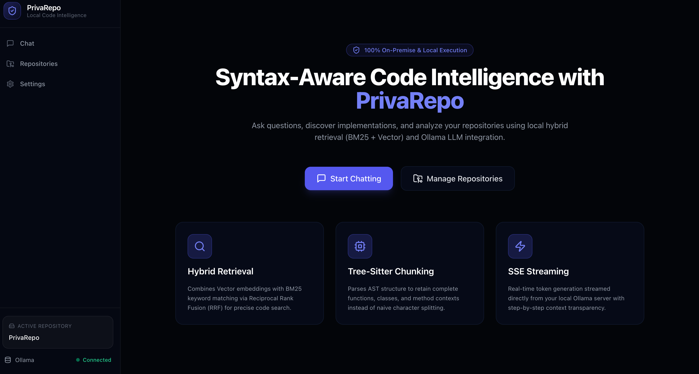
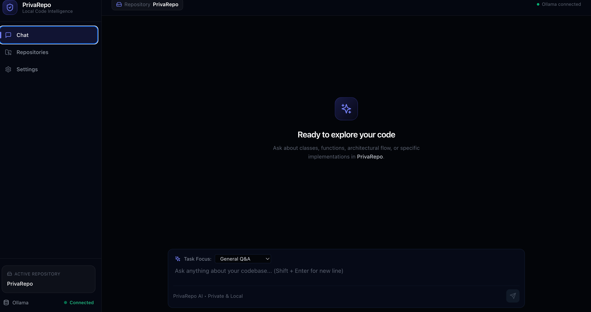
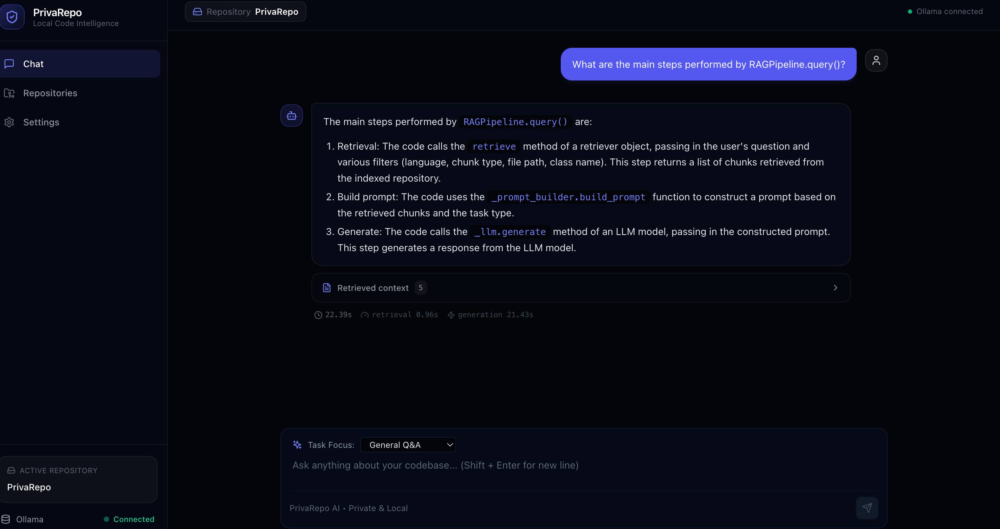
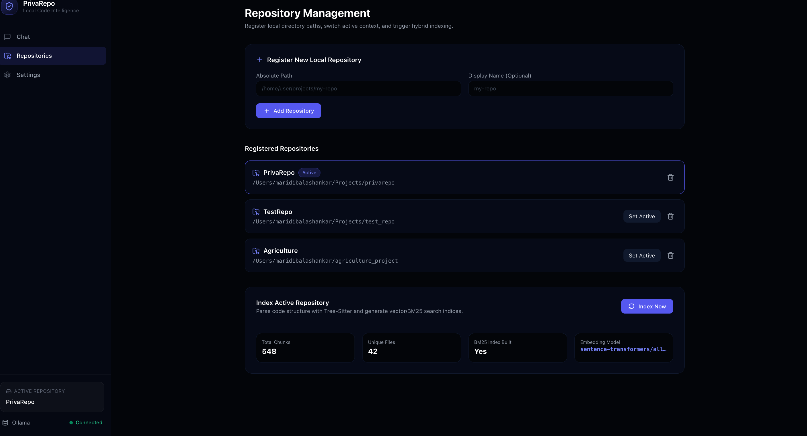

# PrivaRepo 🔒

## Fully Offline Multi-Repository Code Intelligence

PrivaRepo is a local AI-powered code intelligence platform for searching, understanding, and analyzing source-code repositories using Retrieval-Augmented Generation (RAG).

The system combines syntax-aware code parsing, hybrid lexical + semantic retrieval, Reciprocal Rank Fusion (RRF), cross-encoder reranking, and locally hosted LLM inference through Ollama.

The design is focused on keeping repository code local rather than sending source code to a cloud LLM API.

---

## ✨ Key Features

- **Multi-repository support** — register, index, and switch between multiple local repositories.
- **Syntax-aware code indexing** — Tree-sitter extracts logical code units such as functions, methods, classes, imports, and modules.
- **Vector retrieval** — semantic search over indexed code embeddings.
- **BM25 retrieval** — lexical retrieval based on query/code term matching.
- **Hybrid retrieval** — combines vector and BM25 results.
- **Reciprocal Rank Fusion (RRF)** — merges ranked retrieval results.
- **Cross-encoder reranking** — refines candidate relevance before context generation.
- **Local LLM inference** — Ollama-based inference without requiring a remote LLM API.
- **Streaming responses** — answers can be streamed progressively to the web interface.
- **Repository-grounded responses** — answers are generated from retrieved repository context.
- **Source-aware results** — retrieved files, functions, classes, and line ranges can be shown with answers.
- **Task-focused code analysis**:
  - General Q&A
  - Explain Code
  - Find Bugs
  - Similar Code
  - Search Functions
  - Search Classes
- **CLI and REST API** support.
- **Evaluation and benchmarking** for retrieval and generation performance.

---

# 🏗️ Architecture

```text
                        LOCAL REPOSITORY
                               │
                               ▼
                     ┌───────────────────┐
                     │    Tree-sitter    │
                     │   Source Parsing  │
                     └─────────┬─────────┘
                               │
                               ▼
                   ┌────────────────────────┐
                   │ Syntax-aware Chunking  │
                   │                        │
                   │ function / method      │
                   │ class / imports        │
                   │ module                 │
                   └───────────┬────────────┘
                               │
                               ▼
                     ┌──────────────────┐
                     │ Metadata + Code  │
                     │ Context          │
                     └────────┬─────────┘
                              │
                 ┌────────────┴────────────┐
                 ▼                         ▼
        ┌─────────────────┐       ┌─────────────────┐
        │ Vector Embedding│       │   BM25 Index    │
        │ Sentence        │       │ Lexical Search  │
        │ Transformers    │       │                 │
        └────────┬────────┘       └────────┬────────┘
                 │                         │
                 ▼                         ▼
        ┌─────────────────┐       ┌─────────────────┐
        │    ChromaDB     │       │   BM25 Search   │
        │ Vector Search   │       │     Results     │
        └────────┬────────┘       └────────┬────────┘
                 │                         │
                 └────────────┬────────────┘
                              ▼
                 ┌──────────────────────────┐
                 │ Reciprocal Rank Fusion   │
                 │          (RRF)           │
                 └────────────┬─────────────┘
                              ▼
                 ┌──────────────────────────┐
                 │  Cross-Encoder Reranker  │
                 └────────────┬─────────────┘
                              ▼
                 ┌──────────────────────────┐
                 │  Retrieved Code Context  │
                 └────────────┬─────────────┘
                              ▼
                 ┌──────────────────────────┐
                 │      Prompt Builder      │
                 │ Grounded task-specific   │
                 │ instructions + context   │
                 └────────────┬─────────────┘
                              ▼
                 ┌──────────────────────────┐
                 │     Local Ollama LLM     │
                 └────────────┬─────────────┘
                              ▼
                 ┌──────────────────────────┐
                 │ Grounded Code Response   │
                 │ answer + evidence +      │
                 │ referenced files         │
                 └──────────────────────────┘
```

---

# 🔎 Retrieval Pipeline

PrivaRepo uses multiple retrieval stages rather than relying on a single search method.

### 1. Vector Search

Source-code chunks are converted into embeddings and stored in a persistent ChromaDB collection.

Vector search is used to retrieve code that is semantically related to the user's query.

### 2. BM25 Search

A BM25 index provides lexical retrieval based on terms present in the query and indexed repository code.

This is useful when exact identifiers, function names, class names, or implementation terminology matter.

### 3. Hybrid Retrieval

Vector-search results and BM25 results are produced independently and then combined.

### 4. Reciprocal Rank Fusion

RRF combines ranked result lists using their ranking positions rather than directly combining incompatible score scales.

### 5. Cross-Encoder Reranking

The resulting candidate pool is passed to a cross encoder that scores the relationship between the query and each retrieved code document.

This allows more fine-grained query/document relevance scoring before the final context is selected.

---

# 🌳 Syntax-Aware Code Chunking

Instead of treating a source file as arbitrary blocks of text, PrivaRepo uses Tree-sitter to understand source-code structure.

Depending on the language and source structure, indexed chunks can represent:

```text
function
method
class
imports
module
```

Chunk metadata can include:

```text
file path
language
function name
class name
parent class
decorators
docstring information
parameters
return type
async status
line range
chunk type
```

This makes retrieval more useful for source-code questions because the system can reason over logical code units rather than only raw text windows.

---

# 📚 Multi-Repository Support

PrivaRepo can maintain multiple indexed repositories and switch the active repository used for querying.

Each registered repository is associated with its own indexing context, including its vector collection and BM25 index.

Example:

```text
PrivaRepo
TestRepo
Agriculture
```

This allows the same code-intelligence interface to be used across different local codebases.

---

# 🤖 Local LLM Inference

PrivaRepo uses Ollama for local LLM inference.

Models can be selected through configuration/environment variables rather than being hard-coded to a single model.

Models tested during development included:

```text
qwen2.5-coder:1.5b
llama3.2:3b
qwen2.5-coder:7b
```

The larger models provide a quality/latency trade-off, while smaller models are more responsive on resource-constrained hardware.

---

# ⚡ Streaming Responses

The web interface supports streaming responses from the local LLM.

The high-level flow is:

```text
Ollama streaming
       ↓
LLM interface
       ↓
FastAPI SSE endpoint
       ↓
React frontend
       ↓
Incremental answer rendering
```

This allows users to see generated content progressively rather than waiting for the entire response before rendering begins.

---

# 🎯 Task Modes

The interface supports multiple task-focused workflows.

### General Q&A

Ask questions about the indexed repository.

Example:

```text
What does RAGPipeline.query() do?
```

### Explain Code

Request a step-by-step explanation of a function, class, or implementation.

Example:

```text
Explain the retry logic step by step.
```

### Find Bugs

Identify potential bugs based only on retrieved repository evidence.

Example:

```text
Find potential bugs in this function.
```

### Similar Code

Find code structurally or functionally similar to the queried implementation.

### Search Functions

Search the indexed repository for relevant functions or methods.

### Search Classes

Search for classes related to a concept.

---

# 📊 Current Evaluation

The current PrivaRepo retrieval evaluation was performed on an indexed corpus containing:

* **486 code chunks**
* **42 unique files**

### Retrieval Metrics

| Metric | Score |
| :--- | ---: |
| Precision@5 | **70.7%** |
| Recall@5 | **100%** |
| MRR | **92.2%** |
| Hit Rate@5 | **100%** |

These results indicate that the current retrieval pipeline is effective at finding relevant code in the evaluated repository.

### Generation Metrics

The current generation evaluation produced:

| Metric | Score |
| :--- | ---: |
| Faithfulness | 65.3% |
| Answer Relevancy | 65.3% |
| Context Precision | 54.7% |
| Context Recall | 40.0% |

Generation quality is currently a weaker part of the system than retrieval quality. The project therefore treats retrieval effectiveness and local generation as separate evaluation dimensions.

---

# 🖥️ Screenshots

## User Interface



## Chat



## Answer Generated



## Repository



# 🧰 Tech Stack

| Component | Technology |
| :--- | :--- |
| Programming Language | Python |
| Backend | FastAPI |
| Frontend | React |
| Code Parsing | Tree-sitter |
| Vector Database | ChromaDB |
| Embeddings | Sentence Transformers |
| Sparse Retrieval | BM25 |
| Result Fusion | Reciprocal Rank Fusion |
| Reranking | Sentence Transformers Cross-Encoder |
| Local LLM | Ollama |
| CLI | Typer + Rich |
| Evaluation | Local LLM-based evaluation |
| Testing | pytest |

---

# 🚀 Quick Start

## 1. Clone

```bash
git clone <REPOSITORY_URL>
cd LocalRAG
```

## 2. Create Virtual Environment

```bash
python -m venv .venv
source .venv/bin/activate
```

Windows:

```powershell
.venv\Scripts\activate
```

## 3. Install Dependencies

```bash
pip install -r requirements.txt
```

## 4. Install Ollama

Install Ollama locally and pull a compatible code model.

Example:

```bash
ollama pull qwen2.5-coder:7b
```

The active model can be selected through the project's configuration.

---

# 📦 Index a Repository

Using the CLI:

```bash
python -m cli index /path/to/your/project
```

A repository can then be queried through the CLI or web application.

---

# 💬 Query the Repository

Example:

```bash
python -m cli query "How does the authentication system work?"
```

Explain code:

```bash
python -m cli query \
  "Explain the retry logic" \
  --task explain
```

Find bugs:

```bash
python -m cli query \
  "Find potential issues in the connection pool" \
  --task find_bugs
```

---

# 🔍 Raw Hybrid Search

Search the repository without LLM generation:

```bash
python -m cli search "async function error handling"
```

With code snippets:

```bash
python -m cli search "class authentication" --code
```

---

# 📈 Evaluation

Run the complete evaluation suite:

```bash
python -m cli evaluate
```

Save the report:

```bash
python -m cli evaluate \
  --output eval_results/report.json
```

The evaluation framework includes retrieval metrics and local generation-quality metrics.

---

# ⏱️ Benchmarking

Run the latency benchmark:

```bash
python -m cli benchmark
```

The number of benchmark iterations can be configured through the CLI.

---

# 📤 Export / Import

Export the indexed collection:

```bash
python -m cli export collection_backup.ndjson
```

Import a previously exported collection:

```bash
python -m cli import collection_backup.ndjson --reset
```

---

# 🌐 Web Application

Start the backend:

```bash
uvicorn app.main:app --reload --port 8000
```

Start the frontend:

```bash
cd frontend
npm run dev
```

The backend exposes the API used by the web interface.

---

# 🧪 Testing

Run the test suite:

```bash
pytest tests/ -v
```

Example individual test modules:

```bash
pytest tests/test_chunker.py -v
pytest tests/test_retrieval.py -v
pytest tests/test_pipeline.py -v
```

---

# 🗂️ Project Structure

```text
LocalRAG/
│
├── app/
│   ├── routers/
│   │   ├── chat.py
│   │   ├── indexing.py
│   │   ├── repositories.py
│   │   ├── search.py
│   │   └── settings.py
│   └── ...
│
├── frontend/
│
├── config.py
├── rag_pipeline.py
├── tree_sitter_chunker.py
├── vector_store.py
├── llm_interface.py
├── evaluator.py
├── cli.py
├── example_usage.py
├── requirements.txt
├── tests/
├── images/
└── README.md
```

---

# 🧠 Design Decisions

## Why Tree-sitter?

Tree-sitter allows the indexer to identify logical source-code structures such as functions, methods, and classes rather than relying exclusively on arbitrary text windows.

This gives the retrieval pipeline access to useful structural metadata when searching code.

## Why Hybrid Retrieval?

Semantic vector search and lexical BM25 retrieval capture different kinds of relevance.

Vector search can retrieve conceptually related code, while BM25 can be useful when exact repository terminology, identifiers, or function names matter.

Combining both provides broader retrieval coverage than relying on either method alone.

## Why RRF?

Vector similarity and BM25 scores are produced on different scales.

RRF operates on ranking positions, making it possible to combine the ranked outputs without directly assuming that the two scoring distributions are numerically comparable.

## Why Cross-Encoder Reranking?

The cross encoder evaluates the query and retrieved document together rather than independently embedding them.

This provides a second relevance-ranking stage after hybrid retrieval.

## Why Ollama?

The project is designed around local code intelligence.

Using Ollama allows the LLM inference stage to run locally, which is useful when working with private source repositories where sending code to a remote inference API is undesirable.

---

# 🔐 Privacy-Oriented Design

PrivaRepo is designed to support local code analysis.

The intended runtime flow is:

```text
Local Repository
      ↓
Local Index
      ↓
Local Retrieval
      ↓
Local Ollama Model
      ↓
Local Answer
```

No cloud-hosted LLM API is required for the core RAG workflow.

---

# ⚠️ Current Limitations

PrivaRepo is a BTech project and is still being refined.

Current evaluation shows that **retrieval quality is stronger than generation quality**.

Some implementation-oriented questions can still retrieve related wrapper, documentation, or test chunks instead of the most specific implementation body.

The system is therefore intended as a repository-grounded code intelligence assistant rather than a guarantee of perfect code understanding.

---

# 📌 Future Improvements

Possible future improvements include:

- Better implementation-aware retrieval
- Improved query intent classification
- More precise context selection
- Stronger local code-focused generation models
- Lower generation latency
- Larger and more diverse evaluation datasets
- Improved multi-turn repository-aware conversations
- Additional programming language support
